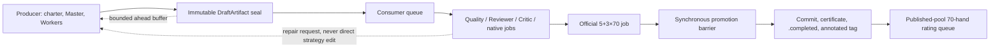
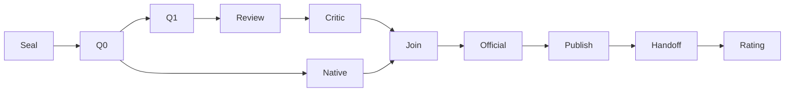

# Producer–Consumer Evolution Pipeline v1

Status: design frozen for incremental implementation; Slice-2 durable
foundation implemented but inert; not an active runtime contract and not
publication authority.

This document operationalizes the open experiment plane in
`docs/open-agent-experiment-architecture-v1.md`. It does not authorize a Bot,
assign a `national_vN`, alter a checkpoint, consume first-strict control,
publish a certificate, or admit a strength sample. Activation requires source
tests, independent review, a stopped-runtime compatibility check and a
content-bound migration receipt.

### Implemented shadow boundary (partial and inert)

The files delivered with this document are a **partial, inert shadow** only.
They provide value validators, a deterministic reducer, a narrow adapter over
the existing `WorkflowStore`, generic kernel heartbeat/per-effect-cancel
primitives and focused restart/CAS tests. They are not imported by the
production orchestrator, scheduler, HTTP routes, rating daemon, official
certifier or publication path, and they do not read or mutate the autonomous
runtime checkout.

The following designed capabilities are deliberately **not implemented** in
this slice and therefore carry no runtime or recovery authority:

- the inert adapter now persists exact `JobEnvelope` values through the
  existing `WorkflowStore` journal/outbox/inbox, supports deterministic
  submit identities, owner/attempt/lease fencing, heartbeat renewal,
  per-effect cancel, restart loading and death-proof reclaim. It is not a
  dispatcher, production workboard API or activation adapter;
- no `retry_at`/exponential-backoff scheduler, priority/resource broker,
  cancellation/drain coordinator or fork/join executor. The existing kernel
  exhausted-retry transition remains available to the inert adapter;
- no fork/join/dependency executor and no adapter for current checkpoint stages;
- no LLM job kinds or dispatch for Master, Scouts, Workers, Reviewer, Critic,
  schema repair, or provider availability; the closed shadow table currently
  models only quality, native and official envelope shapes;
- no raw replay resolver or durable strength-admission CAS and no production
  Git command/ref resolver. The shadow reducer does require a caller-supplied,
  content-addressed strict-artifact resolver for every mechanical-repair event;
  it must return exactly `national_bot.py`, `policy.py` and `precompute.py` for
  each named artifact/manifest. No production adapter supplies it yet. Resolver
  digests are frozen contracts, not proof that any external effect ran.
  Promotion events carry only a receipt digest and resolver digest; the reducer
  requires an independent resolver result and fails closed when none exists.
  The test resolver is not publication authority and no production resolver is
  installed.

Sections below describe the complete target design. Statements about retry,
deferred work, `WorkflowStore`, LLM jobs, publication or admission are future
requirements unless a focused shadow test explicitly covers the pure contract.

## 1. Product decision

Evolution becomes one bounded producer–consumer system implemented on the
existing `WorkflowStore`, not two unrelated schedulers:

- the **Producer lane** continuously creates immutable strategy drafts in
  isolated leases/worktrees;
- the **Consumer lane** validates a sealed draft, may request a narrowly
  proved mechanical repair, runs native/official evidence jobs and promotes
  only a fully compliant artifact;
- the **Promotion barrier** remains synchronous and fail closed even though
  the work which satisfies it runs asynchronously;
- the canonical checkpoint continues to own only the one candidate currently
  inside the version-allocation/publication critical section.

The optimization is therefore higher pipeline occupancy, not weaker gates.
Producer failures and speculative drafts have no certificate, rating, parent,
tag or generation authority.



## 2. Why the current pipeline is under-utilized

The current hard gates are mostly correct. The throughput defect is structural:

1. epoch/checkpoint authority exposes only one `active_generation` and one
   `next_v`;
2. `prepare_generation` recovers that active checkpoint instead of preparing
   independent work;
3. one orchestrator call drives prepare → planning → Worker → all gates →
   publication → cleanup serially;
4. Quality combines cheap static checks, dynamic probes, official smoke and a
   complete 70-hand acceptance in one large operation;
5. Reviewer, Critic, native precommit and formal official certification all
   occur after the Producer has stopped;
6. current kernel leases have fencing and retry, but no generic heartbeat,
   per-effect cancel, retry-at/backoff, priority/resource class or fork/join
   projection.

Real workflow-v64 on 2026-07-19 confirmed both sides of the diagnosis:

- a Master output exceeded the Worker prompt cap by 120 characters; the same
  stage retried and recovered without operator mutation;
- Worker, Quality and Reviewer then completed, proving bounded retry is useful;
- Quality temporarily caused HTTP health timeouts while CPU work ran, then
  health recovered;
- after Critic/native precommit, the workflow parked at the operator-only
  official bootstrap boundary while no strategy-producing Agent could start a
  second draft;
- the new official job could continue in the background, but the canonical
  single-slot design had no Producer lane to occupy the wait.

These observations are operational evidence only. They are not Bot strength or
certification evidence.

## 3. Non-negotiable invariants

The design cannot relax:

- national raw TCP client/server roles, delimiter-free parsing and exact wire
  legality;
- typed `decision_context`/intent and the one system-owned socket send path;
- official deadline, legal fallback and late-result exclusion;
- sandbox, filesystem/network/subprocess/resource isolation;
- content identity for all executable/system-asset bytes;
- one complete 70-hand native match as the minimum strength sample;
- official-full-v5 signed certification before publication;
- immutable commit, `.completed`, annotated completion/high-water tags and
  remote tree proof;
- Official EXE and Arena outcomes have zero strength/rating weight;
- only published strict Bots can be lineage parents or rating participants;
- archive and retired evidence retain zero authority.

An asynchronous job is not an asynchronous rule. Publication synchronously
waits for every required receipt.

## 4. Identity model

### 4.1 Draft identity

A draft starts with opaque `work_item_id` and `draft_id`. `draft_id` identifies
mutable Producer work; after seal, the distinct `candidate_id` identifies one
immutable candidate. Collapsing the two IDs is schema-invalid. A draft does
**not** own:

- a `national_vN` directory;
- `generation_ordinal`;
- a canonical tag;
- a checkpoint;
- a published parent relationship.

On seal it receives `candidate_id` and `artifact_hash`, binding:

- `GenerationCharter` and `ComplianceEnvelope` digests;
- exact published parent/selection/evidence cutoffs, or a greenfield/bootstrap
  declaration with no policy parent;
- Master/Worker prompt and effect receipts;
- exact policy bytes plus the current system runtime/precompute identities;
- repository/evaluation-contract identity and producer receipt.

For v143, `source_v=142` is namespace continuity only and `policy_parent` is
null. An unpublished v143 draft cannot be a v144 parent. Before v143 publishes,
additional production may only use the same neutral bootstrap/greenfield input,
not v143 strategy bytes.

### 4.2 Canonical identity

Only Consumer promotion may claim the global critical section, revalidate the
current epoch/parent/evidence/runtime, allocate `next_v`, materialize the strict
artifact and create the canonical checkpoint. The first successful promotion
for a target fences every other draft for that target. Late completions remain
audit evidence with zero promotion authority.

Identity chain:

```text
Charter digest
→ Producer JobEnvelope
→ DraftArtifact digest
→ ValidationPlan digest
→ child JobReceipts
→ ValidationReceipt
→ PromotionReceipt
→ canonical checkpoint/version
→ signed official certificate
→ commit/.completed/annotated tag/remote proof
```

## 5. User-visible three-state contract

The existing strict checkpoint `STAGE_ORDER` remains the Consumer's detailed
gate route. The requested three states are a separate per-artifact projection:

| Macro state | Allowed substates | Meaning |
|---|---|---|
| `producing` | `queued`, `running`, `retry`, `backpressured` | No immutable consumable artifact yet |
| `awaiting_validation` | `queued`, `running`, `retry`, `infra_blocked` | Exact artifact is sealed and Consumer owns read-only validation |
| `validation_completed` | `promoted`, `rejected`, `quarantined`, `superseded` | A terminal receipt exists; the original artifact can never reopen |

`validation_completed` always carries an outcome. It must never be rendered as
“online” without `promoted`, and `promoted` itself requires the complete
publication identity. `quarantined` means authority was insufficient; it is
not a Bot failure. `rejected` means deterministic/semantic evidence proved the
artifact ineligible. `superseded` means another exact target won or a repair
child replaced it.

Publication is an orthogonal detail:

```text
not_eligible → eligible → canonicalizing → official_certifying
             → publishing → published | abandoned
```

It is not a fourth artifact macro state.

## 6. Same-kernel event model

Each draft is a run in the existing `WorkflowStore`. The root workboard is a
pure projection over those runs; it is not a second database or state machine.

Required domain events:

```text
GenerationCharterAccepted
ProducerJobRequested
DraftArtifactSealed
ValidationQueued
ValidationForkDeclared
ValidationChildReceiptAccepted
ValidationChildFailed
ValidationChildExhausted
ValidationJoinCompleted
MechanicalRepairSuggested
DraftSuperseded
PromotionClaimed
CanonicalArtifactMaterialized
OfficialJobAttached
OfficialJobCompleted
PublicationCommitted
PromotionAbandoned
```

Fork child IDs are deterministic and requested through the current effect +
outbox transaction. Completion uses the existing inbox and atomically appends
the child receipt event. Replay requests only missing children. The join reducer
is deterministic:

- every required receipt passed → `admitted`;
- a proved candidate/hard-gate failure → `rejected`;
- missing, exhausted infrastructure or unverifiable identity →
  `quarantined/inconclusive`;
- Critic text/score never changes the hard outcome, although a schema-valid
  Critic execution receipt remains required.

## 7. JobEnvelope and JobReceipt

`JobEnvelope v1` binds at least:

```text
schema_version, job_id, run_id, draft_id, candidate_id,
artifact_hash, charter_digest, job_kind, purpose,
dependency_receipt_digests, evaluator/runtime/parser/prompt/contract digests,
repository_head, evidence_cutoff, opponent/seed schedule,
idempotency_key, resource_class, priority_class,
retry_policy, deadline, input_refs, envelope_digest
```

Retry of an infrastructure failure must reuse the exact envelope/job ID.
Changing policy bytes, opponent, seed, gate plan, evaluator or runtime creates a
new job. Same idempotency key with a different input digest is a conflict.
The `candidate` input-ref subject is exactly `candidate_id`, never `draft_id`;
the latter remains the producing-work identity only.

For a native sample, the stable admission identity binds the closed `job_kind`,
its policy-owned `purpose`, candidate/opponent, evaluator/parser/timing/seed,
runtime, repository, executor digest **and executor subject**, and
replay-verifier digest. `native-admission` is the pre-publication compliance
purpose. `native-rating` is a distinct published-pool purpose and additionally
binds the immutable published identity, signed official certificate and frozen
rating-cycle authority through mandatory envelope input refs and receipt
evidence fields. The two purposes cannot share a stable admission/CAS identity,
even if their raw match bytes are otherwise identical. Attempt, lease, receipt
time and produced replay digest do not create a second logical match identity
within one purpose. The replay digest remains receipt-bound and must be resolved
externally; a durable CAS must treat two replay payloads for that same stable
identity as a conflict, never as two rating samples.

`JobReceipt v1` binds:

```text
schema_version, job_id, envelope_digest, attempt, lease_epoch,
executor_identity, start/finish, outcome,
result/evidence/replay digests, complete_70_hand_sample_ids, receipt_digest
```

Receipt outcomes distinguish `success`, `candidate_failure`,
`infrastructure_failure` and `cancelled`. Strength pre-admission compares
receipt `attempt`, `lease_owner` and `lease_epoch` to one durable active-effect
row and uses the same strict live-lease rule as
`WorkflowStore.complete_effect`: `finished_at < lease_until`; equality is
expired. The acceptance/CAS timestamp must also be strictly before that
boundary. Acceptance rejects stale attempts, owners or epochs, old
artifact/contract hashes, late superseded results, 69-hand samples and any
Official/Arena result offered as strength. The inert adapter now reads and
claims that durable effect row, but does not perform raw-replay resolution or
the atomic rating-admission CAS; those remain activation blockers.

## 8. Synchronous and asynchronous work

| Work | Execution | Barrier semantics |
|---|---|---|
| Charter, parent/evidence freeze | Producer synchronous input | Required before any provider dispatch |
| Master scouts/ballots/final plan | Producer fork/join | Required to seal the selected implementation contract |
| Workers | Producer fork/join | Required; seal releases Producer |
| Seal safety checks | Short synchronous | Path/no-follow/size/schema/compile/import/basic sandbox and identity |
| Q0 static/cheap gates | Consumer high-priority async | Hard gate |
| Q1 dynamic capability/decision/smoke | Consumer async | Hard gate |
| Reviewer | Consumer async after Q1 | Schema-valid approval hard gate, bounded two-verdict contract |
| Critic | Consumer async after Reviewer | Execution receipt hard; opinion advisory |
| Native admission/precommit | Low-priority resumable async | Complete 70-hand hard gate |
| Official 5+3×70 | Singleton durable async | Compliance/certificate hard gate, zero strength |
| Git publication | Synchronous global mutex | Exact CAS; retry same transaction |
| Post-publication handoff | Async durable maintenance | Must finish before Bot is a successor parent |
| Published-pool rating | Lowest-priority resumable async | Only immutable complete-70 receipts enter cycle |

Initial dependency DAG:



The first implementation may keep Critic → native order while identities are
stabilized. Only jobs that do not consume each other's receipt may be forked.
Two different 70-hand purposes cannot share a result unless their complete
envelopes are byte-equivalent and the contract explicitly authorizes an alias.

## 9. Consumer repair boundary

Consumer AI never chooses a parent, charter, mechanism, threshold, strategy or
promotion. It may emit a `MechanicalRepairSuggestionReceipt`; Producer decides
whether to create a new child artifact.

Automatic strategy-preserving repair requires:

1. a parsable preimage and output;
2. `PolicySemanticDigestV1` equality, computed from
   `ast.parse(type_comments=True)` and
   `ast.dump(annotate_fields=True, include_attributes=False)`;
3. detector/Python grammar/cache identity binding;
4. byte-identical system `national_bot.py` and `precompute.py`;
5. only comments, blank lines, formatting, line endings or encoding
   normalization in `policy.py`;
6. a new artifact hash and complete revalidation; never in-place mutation.

`repair_child_created` additionally parses the complete
`MechanicalRepairReceipt` and cross-binds its detector identity, semantic
digest, input/output policy SHA-256 values and receipt digest to explicit
parent/child artifact and manifest hashes. A self-consistent re-signed receipt
is not authority. Both binding construction and event reduction require the
exact three executable members for both parent and child (directly or from a
caller-supplied controlled resolver). They recompute every member hash and
size, recompute policy encoding and complete AST semantic identity, require the
two policy projections to equal the receipt and each other, and require the two
system-owned files to be byte-identical across parent and child. Missing
resolver evidence, wrong/extra/misnamed members, substituted bytes, re-signed
fake system hashes, changed semantics or unparseable bytes fail closed. The
reducer itself opens no path; both `reduce_events` and
`validate_projection(..., events=...)` must receive and forward the same
deterministic content-addressed resolver when a journal contains a repair.

Promotion receipts use an explicit Git `object_format` (`sha1` or `sha256`).
Every commit, annotated-tag object, peeled tag commit, remote-main object and
high-water tag object must use that format. The parser cross-binds the promotion
receipt to the exact commit, completion tag, high-water tag and remote proof;
SHA-1 object IDs are 40 hexadecimal characters while SHA-256 IDs are 64.
The reducer does not accept a receipt/proof object embedded by the promotion
caller. Its event contains only `promotion_receipt_digest` and
`resolver_digest`; an independent content-addressed resolver must return the
exact receipt and remote proof, bind both resolver identities, and pass all
cross-checks. The resolution contract requires `official_policy_id` to be
exactly `official-full-v5`; a generic official envelope fails closed. Missing,
echo, mismatched or unavailable resolution fails closed.
The builders in the inert module construct test values only; they do not prove
that Git, certification or remote publication occurred.

AST equality deliberately preserves constants, strings/docstrings, imports,
decorators, helpers, comparisons and control flow. Syntax/indent/name/import,
strategy constants, typed-intent behavior, decision probes, native regression,
Reviewer design rejection and bot-side official failure all return to the
Producer. Uncertainty defaults to Producer. The existing text trimmer which can
delete docstrings is not mechanical-repair authority.

## 10. Retry, cancellation and terminal behavior

| Failure | Transition | Artifact bytes |
|---|---|---|
| Provider globally paused/unavailable | `deferred`; resume without attempt debt | unchanged |
| Transport/503/timeout/sandbox spawn/DB busy/bind failure | same-envelope exponential retry with jitter | unchanged |
| Schema-invalid role output | bounded same-slot schema repair only | unchanged |
| Lease timeout | reclaim only after owner-death proof and epoch CAS | unchanged |
| Mechanical whitelist issue | create equal-semantic child revision | formatting/comments only |
| Q0/Q1 candidate failure | terminal reject; enqueue evidence for Producer | new strategy only via Producer |
| Two Reviewer rejections | terminal reject | new strategy only via Producer |
| Critic low score | record advisory and continue | unchanged |
| Native incomplete/69/cancelled | zero weight; rerun only unseen frozen cell | unchanged |
| Native proved regression | reject and return to Producer | new artifact |
| Official infra/inconclusive | same artifact new infra attempt; exhaust→quarantine | unchanged |
| Official bot/protocol failure | reject and return to Producer | new artifact |
| Identity/receipt/CAS corruption | fail closed/quarantine or governed reprepare | no patching |
| Evaluation-contract change | cancel/fence old jobs; revalidate or reprepare | no automatic migration |
| Git/push transient | resume same publication transaction | unchanged |
| Durable publication intent/handoff | reconcile; never generic abandon | unchanged |

There is no silent wait. Every nonterminal job must be `queued`, `running`,
`retry` with `retry_at`, `deferred`, `backpressured` or `infra_blocked`, with an
owner/lease/heartbeat and a backend-provided next action/reason.

The implemented kernel heartbeat is a same-owner/same-attempt/same-epoch CAS.
It renews only a still-live lease and cannot revive an expired, foreign or
terminal lease. Per-effect cancel binds observed status, attempt, lease epoch
and owner, atomically appends `EffectCancelled`, fences the effect and rejects
late completion. Restart recovery claims requested/retry work; expired running
work requires a content-bound owner-death proof before the existing kernel
reclaim transaction increments attempt and lease epoch. These primitives are
present but no production dispatcher invokes them yet.

## 11. Resource broker and backpressure

System-owned priority order:

```text
promotion/handoff recovery (100)
official/current candidate (90)
Q0/Q1 and native admission (80)
Producer LLM (60)
published-pool rating (10)
```

Priority is assigned by code, never by a candidate envelope. Resource classes
are separate: LLM, CPU/native match, official EXE singleton and Git publication
singleton. Aging prevents starvation. Web/Producer retain reserved CPU; rating
uses residual capacity.

Initial high-water limits:

- one producing work item;
- at most two sealed/awaiting-validation artifacts;
- one Consumer promotion head;
- byte/token/cost/age quotas;
- official and publication each singleton.

At high water the Producer becomes explicit `backpressured`; it is not shown as
running. A low-water event resumes it. No draft is silently dropped to make
space.

## 12. API, SSE and frontend

New read-only authority:

- `GET /api/pipeline/workboard`;
- `GET /api/pipeline/artifacts/{candidate_id}`;
- optional paged artifact events endpoint.

The workboard binds epoch, workflow, queue revision and projection digest. It
contains target ordinal/canonical identity, capacity/backpressure, Producer and
Consumer liveness, artifact cards, gate jobs, 70-hand/official progress,
promotion identity, and reducer-produced `allowed_actions/blocked_reasons`.
Frontend code must not infer permission from a color or stage name.

`/api/control/health` receives only a workboard summary/digest. The existing
three checkpoint shapes remain unchanged:

- `/api/pipeline/checkpoint`: raw strict Consumer checkpoint;
- `/api/control/health.pipeline`: recovery/route/scheduler/handoff authority;
- `/api/evolution/state`: summary.

The workboard is not a fourth checkpoint.

SSE publishes only a `workboard_changed` revision/digest signal. The browser
then refetches the authoritative workboard. Old revision, same revision with a
different digest, or epoch/workflow mismatch clears stale state and fails
closed.

The primary UI is a three-column workboard:

1. **生产中** — charter/parent/evidence, Master/Worker, retry/backpressure;
2. **等待检验** — gate DAG, lease/attempt/retry, native 70-hand and official
   5+3 progress;
3. **完成检验** — visibly distinct promoted/rejected/quarantined/superseded
   receipts.

Only promoted artifacts display commit/tag/certificate as completed. Header
separates runtime health, daemon configured/alive, Producer/Consumer liveness,
queue depth, target ordinal/tag, Consumer route and background rating activity.

The existing `codex/evolution-dashboard-redesign` branch currently derives
agent and strength state from stages/files. Those projections are useful as
diagnostics but cannot become queue authority. To minimize conflicts:

1. this branch first owns core contracts/reducer/broker and a new independent
   artifact-pipeline route;
2. the dashboard branch owns visual components only;
3. after backend merge, the dashboard branch rebases and consumes the frozen
   workboard API through a new client module;
4. neither branch independently edits the other's inferred endpoint into an
   authority contract.

## 13. Migration and rollback

Phased activation:

1. **Contract/shadow** — land JobEnvelope/Receipt, pure reducer, semantic repair
   proof and workboard projection. Mirror the current canonical workflow with
   no new provider dispatch or version allocation.
2. **One ahead buffer** — allow one Producer to seal an opaque draft while the
   current Consumer runs; existing canonical gate chain remains unchanged.
3. **Quality fork/join** — split Q0/Q1/native jobs with typed receipts.
4. **Promotion adapter** — Consumer materializes the winner and claims the
   existing checkpoint/version critical section.
5. **Official/rating integration** — wrap durable official and background
   strength jobs in the common contract without changing their evidence
   semantics.

The generic `official-certification` JobEnvelope is scheduling metadata only.
It cannot satisfy, weaken, alias or replace the repository's authoritative
`official-full-v5` harness, signed certificate, commit/`.completed`/annotated
tag and remote publication checks. Likewise, structurally accepted native
samples remain `rating_eligible=false` until a future raw-replay resolver and
durable admission CAS atomically prove the existing rating authority contract.

Cutover requires no active canonical checkpoint, no post-publication handoff
and no nonterminal official job. It writes a content-bound migration receipt.
Rollback stops new dispatch, cancels/drains through fenced receipts and retains
the DB/artifacts; it never deletes state. Canonical runtime remains on the
legacy single-slot path until the shadow projection and crash tests are green.

## 14. Acceptance tests

Required positives:

- Producer seals a second draft while Consumer runs a complete 70-hand or
  official job for the first;
- queue high/low water produces deterministic backpressure/resume;
- exact-envelope infra retry and crash recovery preserve artifact identity;
- comment/format-only repair produces equal semantic digest and new byte hash;
- required fork children join exactly once;
- promotion fences other drafts for the same target;
- complete current-identity 70-hand receipts reach the correct barrier/cycle;
- restart restores queued/running/retry projections and backend actions.

Required negatives:

- constant/comparison/control/import/helper/docstring/syntax changes cannot be
  labelled mechanical;
- system byte, extra-file, manifest, parent/evidence/runtime/contract drift;
- stale attempt/lease owner/lease epoch, completion exactly at lease expiry,
  cancelled/superseded late result and changed-input idempotency collision;
- missing child receipt, out-of-order event or same revision/different digest;
- unpublished parent, v142-as-policy-parent bootstrap error;
- 69-hand, wrong seed/opponent/evaluator, Official/Arena-as-strength poisoning;
- native admission/rating purpose reuse, missing or stale published identity,
  signed certificate or immutable rating-cycle authority;
- re-signed mechanical receipt whose claimed AST or system-member identities do
  not match the resolver-provided parent and child three-file bytes;
- Consumer strategy edit or forged Reviewer/Critic approval;
- concurrent publication owner, tag/push CAS drift;
- stale SSE retains no old green state.

## 15. Delivery slices and estimates

The current v143 delivery remains on the existing tested chain and must not
wait for this refactor.

- Slice 1, contracts/shadow/reducer/workboard: 1–2 focused development days;
- Slice 2a, durable adapter/lease heartbeat/cancel/restart foundation: complete
  in shadow, not activated;
- Slice 2b, one ahead-buffer with current Consumer and resource broker: still
  2–3 focused development days including production integration review;
- Slice 3, Quality/native fork/join: another 2–3 days;
- Slice 4, official/rating/restart canary and frontend: another 1–2 days.

Complete safe dual-line operation is therefore roughly 5–8 development days,
but Slice 2 is the first throughput improvement and can be enabled earlier
after review and a safe runtime boundary.
